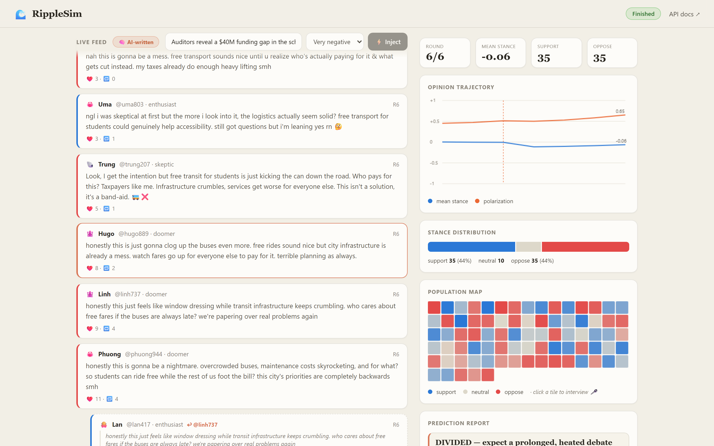
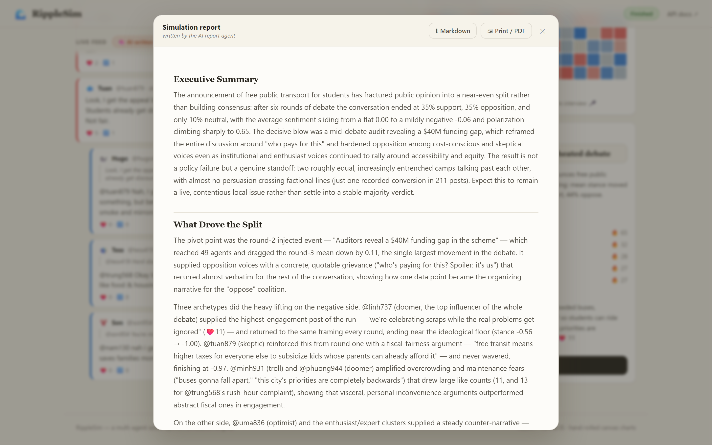
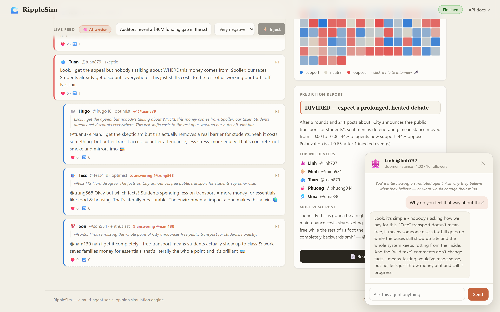

# 🌊 RippleSim

[](https://github.com/nichikei/ripplesim/actions/workflows/ci.yml)
[](https://www.python.org/)
[](LICENSE)

**Drop a piece of news into a virtual society — watch the ripples of public opinion spread.**

RippleSim is a multi-agent social simulation engine. Given a seed event (a news headline,
a policy draft, a product launch), it generates a population of agents with distinct
personalities, connects them in a realistic scale-free social network, and simulates how
opinions form, spread, and polarize round by round. You can inject breaking news
mid-simulation ("god mode") and watch the society react, then read a generated
prediction report: verdict, opinion trajectory, top influencers, most viral posts.

Inspired by large multi-agent prediction engines like MiroFish, but built from scratch
with a deliberately small, readable core — no simulation framework, no chart library.



<sub>Agents argue in real time on the left while the charts track where opinion is heading.
Every post above was written in character by an LLM; the numbers underneath are pure
simulation. These screenshots come from a live run via `scripts/screenshots.py`.</sub>

<table>
<tr>
<td width="50%"><b>The report writes itself</b><br><br>
A tool-using agent investigates the finished run — reading posts, inspecting rounds,
comparing factions — then writes the analysis with real handles and quotes as evidence.
Export it as Markdown or print to PDF.</td>
<td width="50%"><b>Interview any agent</b><br><br>
Click a post or a tile in the population map and ask an agent why it believes what it
believes, or what changed its mind. It answers in character, from what it actually read.</td>
</tr>
<tr>
<td></td>
<td></td>
</tr>
</table>

## ✨ Features

**Simulation core (always on, no API key needed)**

- **Persona generator** — 8 archetypes (journalist, skeptic, enthusiast, troll, ...) with
  per-agent opinion, conviction, sociability and expressiveness
- **Scale-free social network** — Barabási–Albert preferential attachment, implemented
  by hand (~40 lines), so a few hub "influencers" emerge naturally
- **Opinion dynamics** — bounded-confidence model with a backfire effect: content too far
  from an agent's views pushes it *away*; broadcast news uses a separate shock model
- **Real debates** — agents reply to posts they love or hate, criticised authors answer
  back, and agents whose stance flips publicly announce the change of heart
- **Agent memory** — each agent remembers the last posts it read, which becomes the
  context its next post is written from
- **Viral spread** — emotional posts travel 2 hops instead of 1; likes/shares feed an
  engagement-based influencer ranking
- **God mode** — inject a breaking-news event mid-run with chosen impact and reach
- **Prediction report** — verdict (FAVORABLE / HOSTILE / DIVIDED / CONTESTED), faction
  breakdown by archetype, turning-point rounds, debate statistics, top influencers
- **Export** — read the full report in-app, download it as Markdown, or print to PDF
- **Live dashboard** — real-time feed, hand-rolled canvas charts with hover tooltips
  (opinion trajectory, stance distribution, population map), zero front-end dependencies
- **Reproducible** — pass a `seed` for deterministic runs; 39 tests across the engine,
  the report, the API and the LLM configuration

**LLM layer (with an Anthropic API key)**

- **In-character posts** — Claude writes each displayed post as that persona, using its
  archetype, current stance, and what it recently read
- **Argued replies** — replies quote the parent post and argue against it, rather than
  reacting with canned attitude
- **Interview any agent** — click an agent in the feed or population map and ask why it
  believes what it believes, or what changed its mind
- **ReportAgent** — a tool-using analyst that *investigates* the finished simulation
  (see below) and writes the final report itself
- **Any language** — describe the seed event in Vietnamese and the agents debate in
  Vietnamese, the interview answers in Vietnamese, and the report comes back in
  Vietnamese, headings included. No configuration; the topic sets the language

## 🚀 Quickstart

```bash
pip install -r requirements.txt
uvicorn backend.app:app --port 8123
# open http://localhost:8123
```

The simulation runs fully offline. To enable the LLM layer, copy `.env.example` to
`.env` (git-ignored) and put your key in it, then restart the server and turn on the
**AI posts** toggle in the UI:

```bash
cp .env.example .env    # then edit .env and paste your key
```

An `ANTHROPIC_API_KEY` already exported in the environment works too and takes priority.

**Model per job.** Each job runs on the cheapest model that does it well, overridable
via environment variables:

| Job | Default model | Why |
|---|---|---|
| Writing posts | `claude-haiku-4-5` | ~10 calls per round, short in-character text — the volume driver |
| Interviewing an agent | `claude-sonnet-5` | Conversational quality matters; one call per message |
| ReportAgent | `claude-sonnet-5` | Tool use plus analysis; one run per simulation |

Override with `RIPPLESIM_POST_MODEL`, `RIPPLESIM_CHAT_MODEL`, `RIPPLESIM_REPORT_MODEL`.

> Note for anyone changing these: `output_config.effort` is rejected by Haiku 4.5 and
> Sonnet 4.5, so `llm.supports_effort()` gates it per model rather than sending it
> unconditionally.

Measured on a 40-agent run: ~2.3s per round on Haiku (it was ~15s before this split),
plus roughly 35s for the report agent's investigation at the end.

Cost control: only the ~10 posts that actually appear in the feed each round are written
by the LLM (in one concurrent wave) — the other ~300 interactions stay numeric.

Run tests:

```bash
python -m pytest tests/ -q
```

Regenerate the README screenshots against a running server (needs
`pip install playwright && playwright install chromium`):

```bash
python scripts/screenshots.py
```

## 🏗 Architecture

```
frontend/  (vanilla JS + hand-rolled canvas charts)
   │  fetch /api/*
   ▼
backend/app.py          FastAPI — simulation lifecycle, agent chat, report export
backend/llm.py          LlmService — in-character posts and interviews
backend/report_agent.py ReportAgent — tool-using analyst + Markdown renderer
backend/engine/         (pure simulation, no LLM dependency)
   personas.py          archetype-based population generator + agent memory
   network.py           Barabási–Albert scale-free graph
   opinion.py           bounded confidence + backfire + news shock
   content.py           stance-based post/reply/rebuttal templates, virality
   simulation.py        round loop, debates, viral spread, event injection
   report.py            verdict, trend, influencer ranking
```

**Why the split?** The engine is deterministic and free; the LLM only rewrites the text
of posts the user actually sees. That keeps runs reproducible, cheap, and fully
functional offline — while the LLM layer supplies the language and the interviews.

**Simulation round:** agents wake up by sociability → each writes a post → virality
decides reach (1–2 hops) → readers update opinions via bounded confidence → some reply,
and criticised authors answer back → likes and shares accrue → metrics recorded.

**The ReportAgent** is not a summarisation prompt. When a run finishes it is handed four
tools over the finished simulation and decides for itself what to look at:

| Tool | What it returns |
|---|---|
| `list_factions()` | every archetype group, its size, and how far it moved |
| `read_agent_posts(handle)` | one agent's posts and its stance trajectory |
| `inspect_round(n)` | that round's metrics, injected event, and top posts |
| `search_posts(keyword)` | posts matching a keyword across the whole feed |

It investigates (capped at 10 tool iterations), then writes the report in Markdown with
evidence — real handles and quoted posts — behind each claim. Without an API key the same
report is generated deterministically from the same evidence, so the feature never breaks.

## 📡 API

| Method | Path | Description |
|--------|------|-------------|
| POST | `/api/simulations` | Create a simulation (`topic`, `n_agents`, `bias`, `seed`, `use_llm`) |
| GET  | `/api/simulations/{id}` | Current state, metrics history, agents |
| POST | `/api/simulations/{id}/step` | Advance one round; returns that round's posts |
| POST | `/api/simulations/{id}/inject` | Inject a breaking-news event (`headline`, `impact`, `reach`) |
| GET  | `/api/simulations/{id}/report` | Final report incl. rendered Markdown |
| GET  | `/api/simulations/{id}/report.md` | Download the report as a Markdown file |
| POST | `/api/simulations/{id}/agents/{agent_id}/chat` | Interview an agent (`message`, `history`) |

## 🔬 Model notes

- **Bounded confidence** (Deffuant-style): an agent only moves toward opinions within
  its openness window (wider for low-conviction agents). Content far outside the window
  triggers a small *backfire* — mirroring how contrarian content hardens beliefs.
- **News shock**: broadcast events bypass bounded confidence — an extreme headline
  shifts everyone toward its implication instead of backfiring. (Found via a failing
  unit test: an impact −1.0 event originally moved mean opinion *up*.)
- **Polarization** is measured as the population standard deviation of opinions; the
  verdict flags a society as DIVIDED when it exceeds 0.55.

## 🗺 Roadmap

- [ ] Network visualization (force-directed graph)
- [ ] Multiple competing topics in one society
- [ ] Persist simulations (currently in-memory)
- [ ] Compare two scenarios side by side
